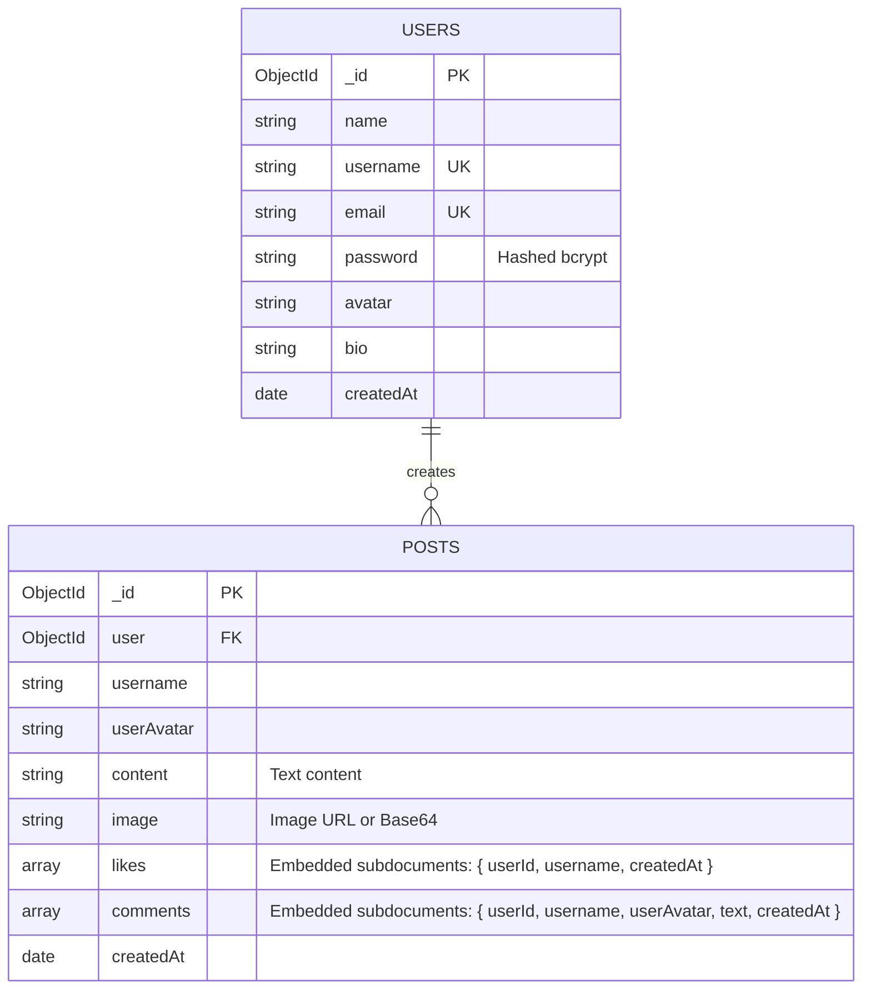

# TaskPlanet Social

A modern, responsive full-stack social feed web application inspired by the TaskPlanet platform. Users can discover community updates, publish posts with text and media, engage through instant optimistic likes and discussion comments, customize profiles, and toggle between dark and light themes.

---

## Features

- **Public Feed & Discovery**: Real-time community timeline supporting chronological and most-liked sorting with pagination.
- **Rich Post Composer**: Create posts with formatted text, media uploads, or direct image links.
- **Instant Optimistic Updates**: Like and comment interactions update immediately in the UI with animated feedback and automatic server sync.
- **User Authentication**: Secure JWT-based registration and login with bcrypt password hashing.
- **Pre-configured Demo Accounts**: Instant one-click test credentials to explore the platform without registration.
- **Profile Management**: Customizable user bios, display names, and avatar styles.
- **Responsive Design & Dark Mode**: Handcrafted pure CSS design system optimized for desktop, tablet, and mobile views with instant theme switching.

---

## Tech Stack

| Layer | Technologies |
| :--- | :--- |
| **Frontend** | React 19, Vite, Lucide Icons, Canvas Confetti |
| **Styling** | Custom Pure CSS Design System (Zero TailwindCSS dependency) |
| **Backend** | Node.js, Express 4, RESTful API architecture |
| **Database** | MongoDB & Mongoose (with automated In-Memory fallback for local development) |
| **Security** | JSON Web Tokens (JWT), Bcrypt password hashing, CORS protection |

---

## Architecture & Data Model

The application uses an efficient document model with two core collections in MongoDB: `users` and `posts`. Likes and comments are modeled as embedded subdocuments inside each post to enable single-query feed retrieval and atomic interaction updates.



---

## Getting Started

### Prerequisites
- Node.js (v18 or higher)
- npm (v9 or higher)

### Quick Start (Local Development)

The backend includes an automatic **In-Memory MongoDB Server** fallback. If no external `MONGO_URI` is provided in `.env`, the server boots an isolated in-memory database and auto-seeds sample posts and users so you can run the app immediately with zero configuration.

```bash
# 1. Clone the repository
git clone https://github.com/<your-username>/taskplanet-social-app.git
cd taskplanet-social-app

# 2. Install dependencies for root, frontend, and backend
npm run install:all

# 3. Start frontend and backend concurrently
npm run dev
```

- **Frontend**: [http://localhost:3000](http://localhost:3000)
- **Backend API**: [http://localhost:5001](http://localhost:5001)

---

## Demo Accounts

For rapid exploration, sample accounts are pre-seeded and accessible via quick login buttons in the Auth Modal:

| Name | Username | Email | Password |
| :--- | :--- | :--- | :--- |
| **Aarav Sharma** | `aarav_tech` | `aarav@taskplanet.com` | `Password123!` |
| **Priya Patel** | `priya_design` | `priya@taskplanet.com` | `Password123!` |
| **Rohan Verma** | `rohan_codes` | `rohan@taskplanet.com` | `Password123!` |

*(You can also register a new account at any time via the Sign Up form.)*

---

## API Reference

### Authentication (`/api/auth`)
- `POST /api/auth/register` — Register a new user account
- `POST /api/auth/login` — Authenticate user and receive JWT token
- `GET /api/auth/me` — Fetch authenticated user profile *(Protected)*
- `PUT /api/auth/profile` — Update display name, bio, and avatar *(Protected)*

### Posts (`/api/posts`)
- `GET /api/posts?page=1&limit=10&sort=latest` — Paginated community feed (`latest` or `mostLiked`)
- `GET /api/posts/:id` — Retrieve post by ID
- `POST /api/posts` — Create a new post with text, image, or both *(Protected)*
- `PUT /api/posts/:id/like` — Toggle like status and record username *(Protected)*
- `POST /api/posts/:id/comment` — Add a comment to a discussion thread *(Protected)*
- `DELETE /api/posts/:id` — Remove a post *(Author only, Protected)*

### System
- `GET /api/health` — Service health and database connection status

---

## Project Structure

```
taskplanet-social-app/
├── frontend/                   # React Single Page Application
│   ├── public/                 # Static web assets & icons
│   ├── src/
│   │   ├── components/         # Reusable UI components
│   │   │   ├── Navbar.jsx          # Header, global search & theme toggle
│   │   │   ├── StoriesBar.jsx      # Top highlights & story row
│   │   │   ├── CreatePostBox.jsx   # Post composer with file/URL upload
│   │   │   ├── PostCard.jsx        # Feed item with likes, media, & actions
│   │   │   ├── CommentSection.jsx  # Interactive discussion comments
│   │   │   ├── AuthModal.jsx       # Login & signup with demo pills
│   │   │   ├── ProfileModal.jsx    # User profile viewer & editor
│   │   │   ├── LeftSidebar.jsx     # Navigation tabs & community tips
│   │   │   ├── RightSidebar.jsx    # Trending tags & suggested creators
│   │   │   └── MobileBottomNav.jsx # Bottom navigation on mobile devices
│   │   ├── context/            # AuthContext (state & session management)
│   │   ├── services/           # api.js (Fetch HTTP client with token handling)
│   │   ├── index.css           # Custom design system & theme variables
│   │   ├── App.jsx             # Root layout & feed state container
│   │   └── main.jsx
│   ├── vite.config.js
│   └── package.json
│
├── backend/                    # Express REST API Server
│   ├── controllers/            # Request handlers (authController, postController)
│   ├── middleware/             # JWT auth validation & optional auth
│   ├── models/                 # Mongoose schemas (User, Post)
│   ├── routes/                 # Express route definitions
│   ├── utils/                  # Database seeding utilities
│   ├── server.js               # Application entrypoint & MongoDB connection
│   └── package.json
│
├── test-e2e.js                 # Integration & API verification test suite
├── package.json                # Root concurrent scripts runner
└── README.md
```

---

## Testing

An automated end-to-end test script verifies health checks, registration, authentication, post creation (text, image, and full), optimistic like toggling, comment threads, permission checks, and post deletion:

```bash
# Run tests against local server
node test-e2e.js
```

---

## Deployment

### Backend (Render / Railway)
1. Point your deployment service to the `backend/` root directory.
2. Set Build Command to `npm install` and Start Command to `npm start`.
3. Set environment variables:
   - `PORT`: `5001`
   - `NODE_ENV`: `production`
   - `JWT_SECRET`: `<strong-secret-key>`
   - `MONGO_URI`: `<your-mongodb-atlas-uri>`

### Frontend (Vercel / Netlify)
1. Import repository and set root directory to `frontend/`.
2. Set Build Command to `npm run build` and Output Directory to `dist`.
3. Add Environment Variable:
   - `VITE_API_URL`: `<your-deployed-backend-url>`

---

## License

This project is open-source and available under the [MIT License](LICENSE).
